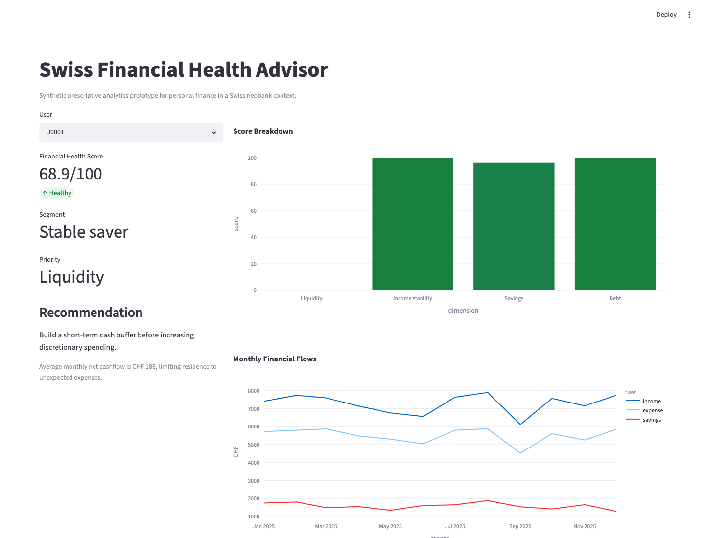

# Swiss Financial Health Advisor

Prescriptive analytics prototype for personal financial health in a Swiss neobank context.

This project turns a final degree thesis concept into a working data science product prototype: synthetic Open Banking-style transactions are transformed into customer segments, an explainable financial health score, and personalized recommendations.



## Why This Exists

Digital banking apps give users access to transactions, balances, and spending summaries. That does not automatically help them make better decisions.

The core problem behind this project is the gap between **financial data availability** and **actionable financial understanding**. The prototype explores how a neobank could add a prescriptive analytics layer on top of transaction data while keeping the system explainable and compatible with privacy-conscious financial environments.

The context is inspired by the Swiss fintech ecosystem and by a final degree project for the Bachelor's Degree in Data Science at Universidad Siglo 21, Argentina.

## What The Prototype Does

1. Generates fully synthetic personal banking transactions.
2. Engineers monthly behavioral features per user.
3. Builds an explainable Financial Health Score from 0 to 100.
4. Segments users with K-Means clustering.
5. Produces prescriptive recommendations based on each user's weakest dimension.
6. Presents the output in a Streamlit dashboard.

## Demo Metrics

The current generated demo includes:

| Metric | Value |
| --- | ---: |
| Synthetic transactions | 57,466 |
| Synthetic users | 150 |
| Behavioral segments | 5 |
| K-Means silhouette score | 0.632 |

## Financial Health Score

The score is intentionally simple and auditable. It combines four dimensions:

| Dimension | Interpretation |
| --- | --- |
| Liquidity | Ability to absorb short-term expenses through positive monthly cashflow. |
| Income stability | Regularity of income inflows across months. |
| Savings capacity | Share of income retained or transferred to savings. |
| Debt exposure | Relative burden of debt payments compared with income. |

The final score is a weighted composite:

| Component | Weight |
| --- | ---: |
| Liquidity | 30% |
| Savings capacity | 30% |
| Income stability | 20% |
| Debt exposure | 20% |

## Segmentation Logic

Users are segmented using K-Means over interpretable behavioral features:

- average income
- average savings rate
- average debt-to-income ratio
- average discretionary spending ratio
- income coefficient of variation

The resulting clusters are translated into business-readable segment labels such as `Stable saver`, `Variable income`, `Debt pressure`, `High discretionary`, and `Balanced user`.

## Recommendation Engine

The recommendation engine identifies the weakest score dimension for each user and returns a targeted action.

Example:

```text
Priority dimension: Savings capacity
Recommendation: Automate a savings transfer near payday and target a first milestone of 10% of income.
Explanation: Average savings rate is 4.7%, below a sustainable long-term target.
```

This is rule-based by design. In a regulated financial context, a transparent baseline is often a better first version than an opaque model that is difficult to audit.

## Architecture

```text
Synthetic transactions
        |
        v
Monthly feature engineering
        |
        +--> Financial Health Score
        |
        +--> K-Means segmentation
        |
        v
Prescriptive recommendations
        |
        v
Streamlit dashboard
```

## Project Structure

```text
.
├── app/
│   └── streamlit_app.py
├── data/
│   ├── recommendations.csv
│   ├── scored_users.csv
│   ├── segment_centroids.csv
│   ├── synthetic_transactions.csv
│   └── user_monthly_features.csv
├── docs/
│   ├── assets/
│   │   └── dashboard-overview.png
│   └── linkedin-post.md
├── scripts/
│   └── build_demo_data.py
├── src/
│   └── swiss_financial_health/
│       ├── clustering.py
│       ├── data_generation.py
│       ├── features.py
│       ├── recommendations.py
│       └── scoring.py
└── tests/
    └── test_pipeline.py
```

## Quick Start

```bash
python -m venv .venv
source .venv/bin/activate
pip install -r requirements.txt
python scripts/build_demo_data.py
streamlit run app/streamlit_app.py
```

Then open:

```text
http://localhost:8501
```

## Regulated AI Considerations

This project is deliberately framed as a decision-support prototype, not as an automated financial decision system.

Important design choices:

- Synthetic data only.
- No credit approval, pricing, or eligibility decisions.
- Explainable score components.
- Human-readable recommendation rules.
- Clear separation between analytics signals and financial advice.

## Roadmap

- Add a notebook with exploratory analysis and model validation.
- Add cohort-level trend analysis.
- Add SHAP-style explanations if predictive models are introduced.
- Add a FastAPI scoring endpoint.
- Add multi-source Open Banking simulation.
- Add Docker support for reproducible deployment.

## Disclaimer

This is an educational and portfolio project. It uses synthetic data and simplified rules. It should not be used for real financial decisions, credit assessment, or regulated automated decision-making.
