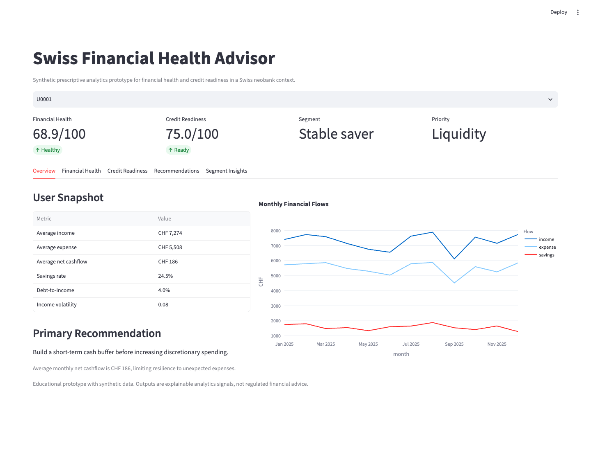

# Swiss Financial Health Advisor

[](https://github.com/FranciscoRossi48/swiss-financial-health-advisor/actions/workflows/ci.yml)
[](https://swiss-financial-health-advisor.streamlit.app)

Prescriptive analytics prototype for personal financial health and credit readiness in a Swiss neobank context.

🔗 **[Try the live demo](https://swiss-financial-health-advisor.streamlit.app)** — no cloning required.

This project turns a final degree thesis concept into a working data science product prototype: synthetic Open Banking-style transactions are transformed into customer segments, an explainable financial health score, a credit readiness signal, risk flags, and personalized recommendations.



## Why This Exists

Digital banking apps give users access to transactions, balances, and spending summaries. That does not automatically help them make better decisions.

The core problem behind this project is the gap between **financial data availability** and **actionable financial understanding**. The prototype explores how a neobank could add a prescriptive analytics layer on top of transaction data while keeping the system explainable and compatible with privacy-conscious financial environments.

The context is inspired by the Swiss fintech ecosystem and by a final degree project for the Bachelor's Degree in Data Science at Universidad Siglo 21, Argentina.

## What The Prototype Does

1. Generates fully synthetic personal banking transactions.
2. Engineers monthly behavioral features per user.
3. Builds an explainable Financial Health Score from 0 to 100.
4. Segments users with K-Means clustering.
5. Adds a Credit Readiness Score for non-decisional affordability guidance.
6. Produces risk flags and prescriptive recommendations based on each user's weakest dimensions.
7. Simulates whether a hypothetical new loan fits a user's current financial profile.
8. Presents the output in a Streamlit dashboard.

## Analytical Validation

The repository includes a notebook that validates the main analytical assumptions behind the MVP:

[notebooks/01_exploratory_analysis_and_model_validation.ipynb](notebooks/01_exploratory_analysis_and_model_validation.ipynb)

It covers synthetic data coverage, score distribution, feature relationships, segmentation quality, and recommendation alignment.

## Demo Metrics

The current generated demo includes:

| Metric | Value |
| --- | ---: |
| Synthetic transactions | 57,466 |
| Synthetic users | 150 |
| Behavioral segments | 5 |
| K-Means silhouette score | 0.632 |
| Credit readiness risk flags | 236 |

## Financial Health Score

The score is intentionally simple and auditable. It combines four dimensions:

| Dimension | Interpretation |
| --- | --- |
| Liquidity | Ability to absorb short-term expenses through positive monthly cashflow. |
| Income stability | Regularity of income inflows across months. |
| Savings capacity | Share of income retained or transferred to savings. |
| Debt exposure | Relative burden of debt payments compared with income. |

The final score is a weighted composite:

| Component | Weight |
| --- | ---: |
| Liquidity | 30% |
| Savings capacity | 30% |
| Income stability | 20% |
| Debt exposure | 20% |

## Segmentation Logic

Users are segmented using K-Means over interpretable behavioral features:

- average income
- average savings rate
- average debt-to-income ratio
- average discretionary spending ratio
- income coefficient of variation

The resulting clusters are translated into business-readable segment labels such as `Stable saver`, `Variable income`, `Debt pressure`, `High discretionary`, and `Balanced user`.

## Recommendation Engine

The recommendation engine identifies the weakest score dimension for each user and returns a targeted action.

Example:

```text
Priority dimension: Savings capacity
Recommendation: Automate a savings transfer near payday and target a first milestone of 10% of income.
Explanation: Average savings rate is 4.7%, below a sustainable long-term target.
```

This is rule-based by design. In a regulated financial context, a transparent baseline is often a better first version than an opaque model that is difficult to audit.

Every threshold used across the scoring, credit readiness, and risk-flagging logic is documented and justified in [docs/scoring-methodology.md](docs/scoring-methodology.md).

## Credit Readiness Layer

The credit readiness layer is not a credit approval model. It is a decision-support signal that estimates whether a user appears financially prepared to assume additional credit exposure.

It combines:

| Dimension | Interpretation |
| --- | --- |
| Income reliability | Stability of recurring inflows. |
| Debt capacity | Current debt burden relative to income. |
| Cashflow resilience | Free monthly cashflow after expenses and savings transfers. |
| Savings discipline | Regular ability to retain income. |
| Spending control | Share of income allocated to discretionary categories. |

The system also generates explainable risk flags such as high debt burden, variable income, thin cashflow buffer, low savings discipline, and high discretionary spend.

## Loan Affordability Simulator

The dashboard's Loan Simulator tab lets a user try a hypothetical loan amount, interest rate, and term against their own profile. It applies the same affordability guideline documented in [docs/scoring-methodology.md](docs/scoring-methodology.md) (total debt service within roughly a third of gross income) and reports the resulting monthly payment, debt-to-income, and projected free cashflow, with an affordable / marginal / not recommended verdict. Like the credit readiness score, this is a decision-support estimate, not a loan offer or approval.

## Architecture

```text
Synthetic transactions
        |
        v
Input validation
        |
        v
Monthly feature engineering
        |
        +--> Financial Health Score
        |
        +--> Credit Readiness Score + Risk Flags --> Loan Affordability Simulator
        |
        +--> K-Means segmentation
        |
        v
Prescriptive recommendations
        |
        v
Streamlit dashboard
```

## Project Structure

```text
.
├── app/
│   └── streamlit_app.py
├── data/
│   ├── recommendations.csv
│   ├── risk_flags.csv
│   ├── scored_users.csv
│   ├── segment_centroids.csv
│   ├── synthetic_transactions.csv
│   └── user_monthly_features.csv
├── docs/
│   ├── assets/
│   │   └── dashboard-overview.png
│   └── scoring-methodology.md
├── scripts/
│   └── build_demo_data.py
├── src/
│   └── swiss_financial_health/
│       ├── affordability.py
│       ├── clustering.py
│       ├── credit_readiness.py
│       ├── data_generation.py
│       ├── features.py
│       ├── recommendations.py
│       ├── scoring.py
│       └── validation.py
└── tests/
    ├── test_affordability.py
    ├── test_clustering.py
    ├── test_credit_readiness.py
    ├── test_data_generation.py
    ├── test_features.py
    ├── test_pipeline.py
    ├── test_recommendations.py
    ├── test_scoring.py
    └── test_validation.py
```

## How To Run Locally

Prerequisites:

- Git
- Python 3.10 or newer

Clone the repository:

```bash
git clone https://github.com/FranciscoRossi48/swiss-financial-health-advisor.git
cd swiss-financial-health-advisor
```

Create and activate a virtual environment.

macOS/Linux:

```bash
python -m venv .venv
source .venv/bin/activate
```

Windows PowerShell:

```powershell
python -m venv .venv
.venv\Scripts\Activate.ps1
```

Install dependencies, generate the demo data, and start the dashboard:

```bash
pip install -r requirements.txt
python scripts/build_demo_data.py
streamlit run app/streamlit_app.py
```

Then open:

```text
http://localhost:8501
```

What the commands do:

- `python -m venv .venv` creates an isolated Python environment for the project.
- `source .venv/bin/activate` or `.venv\Scripts\Activate.ps1` activates that environment.
- `pip install -r requirements.txt` installs the libraries used by the app and analytics pipeline.
- `python scripts/build_demo_data.py` regenerates the synthetic CSV files used by the dashboard.
- `streamlit run app/streamlit_app.py` starts the local web app.

To stop the dashboard, press `Ctrl+C` in the terminal where Streamlit is running.

## API

A read-only FastAPI service exposes the same precomputed scores and the loan affordability
simulation over HTTP, for programmatic access outside the Streamlit dashboard. Start it after
generating the demo data:

```bash
uvicorn app.api:app --reload
```

Then open `http://localhost:8000/docs` for interactive API documentation, or try:

```bash
curl http://localhost:8000/users/U0001
curl -X POST http://localhost:8000/users/U0001/loan-affordability \
  -H "Content-Type: application/json" \
  -d '{"loan_amount": 10000, "annual_rate": 0.05, "term_years": 3}'
```

| Endpoint | Description |
| --- | --- |
| `GET /health` | Liveness check. |
| `GET /users` | List all synthetic user IDs. |
| `GET /users/{user_id}` | Financial health and credit readiness scores for one user. |
| `GET /users/{user_id}/risk-flags` | Credit readiness risk flags for one user. |
| `GET /users/{user_id}/recommendation` | Priority recommendation for one user. |
| `POST /users/{user_id}/loan-affordability` | Simulate a hypothetical loan against one user's profile. |

## Regulated AI Considerations

This project is deliberately framed as a decision-support prototype, not as an automated financial decision system.

Important design choices:

- Synthetic data only.
- No credit approval, pricing, or eligibility decisions.
- Explainable score components.
- Non-decisional credit readiness signal.
- Transparent risk flags.
- Human-readable recommendation rules.
- Clear separation between analytics signals and financial advice.

## Roadmap

- Add cohort-level trend analysis.
- Add SHAP-style explanations if predictive models are introduced.
- Add multi-source Open Banking simulation.
- Add Docker support for reproducible deployment.

## Disclaimer

This is an educational and portfolio project. It uses synthetic data and simplified rules. It should not be used for real financial decisions, credit assessment, or regulated automated decision-making.